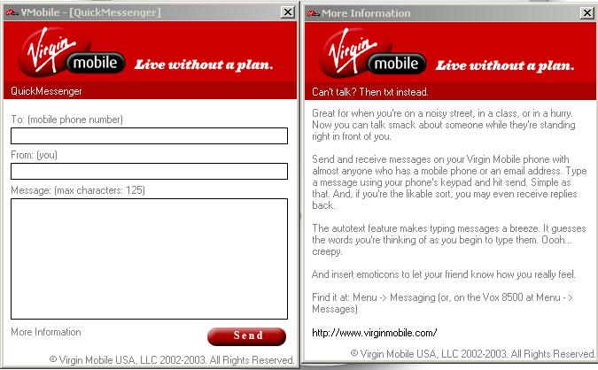



## Virgin Mobile sms

### Description

This is a SMS program. You can send unlimited SMS's for free without signing up for anything. I gave Virgin Mobile a bunch of credit for this because I dont know much about the legal stuff. But Please feel free to leave your comments and VOTE!!!!
 
### More Info
 

             |
---                |---
**Submitted On**   |2004-01-13 15:29:50
**By**             |[Jeff Broderick](https://github.com/Planet-Source-Code/PSCIndex/blob/master/ByAuthor/jeff-broderick.md)
**Level**          |Intermediate
**User Rating**    |4.8 (29 globes from 6 users)
**Compatibility**  |VB 3\.0, VB 4\.0 \(16\-bit\), VB 4\.0 \(32\-bit\), VB 5\.0, VB 6\.0
**Category**       |[Complete Applications](https://github.com/Planet-Source-Code/PSCIndex/blob/master/ByCategory/complete-applications__1-27.md)
**World**          |[Visual Basic](https://github.com/Planet-Source-Code/PSCIndex/blob/master/ByWorld/visual-basic.md)
**Archive File**   |[Virgin\_Mob1693941132004\.zip](https://github.com/Planet-Source-Code/jeff-broderick-virgin-mobile-sms__1-50982/archive/master.zip)

